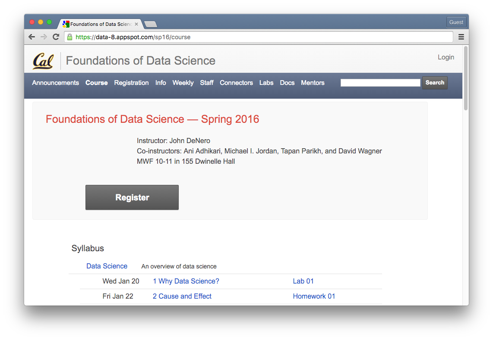
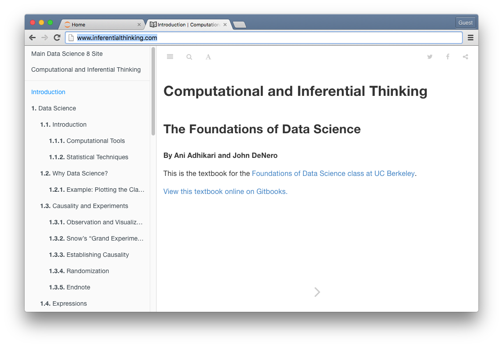
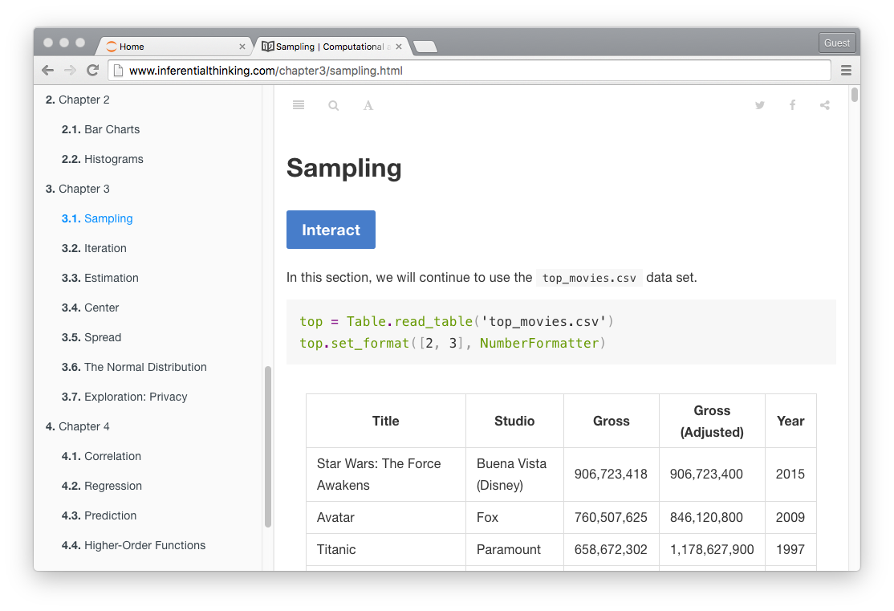
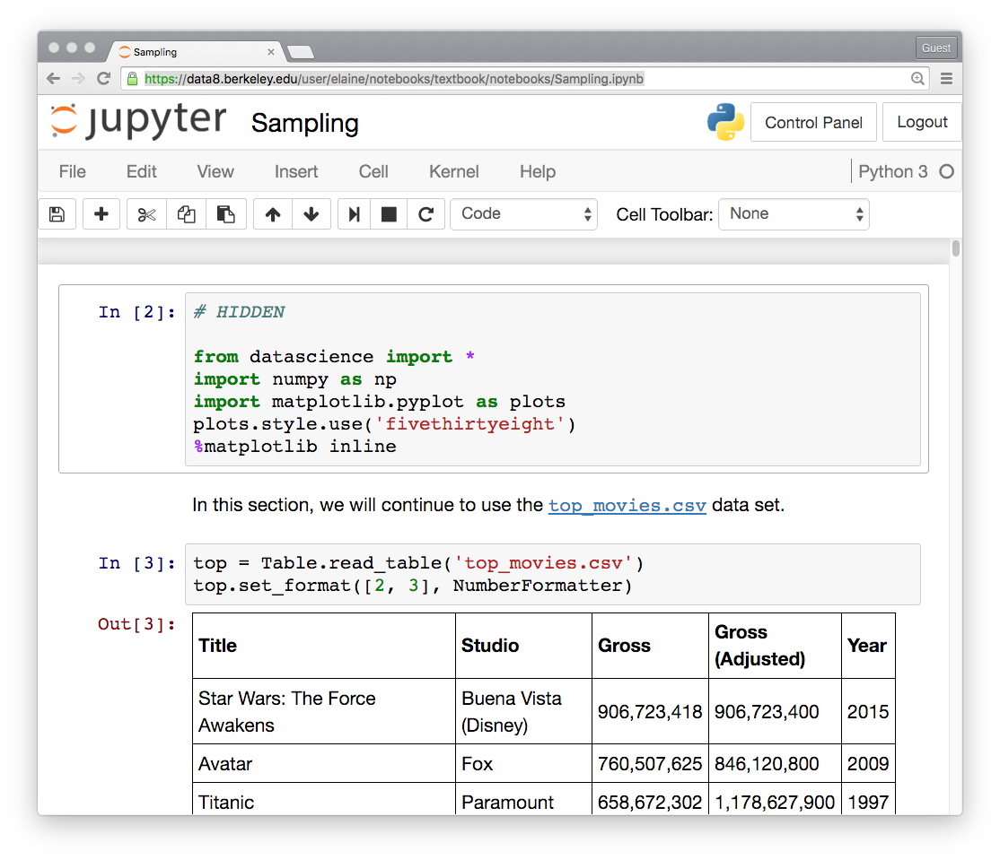

## Jupyter in UC Berkeley's data science education program

* This document provides a guided tour of information distributed across many web pages and GitHub repositories involved in running a live suite of data science courses at the University of California, Berkeley.
* These valuable resources -- designed for and by UC Berkeley students, instructors, and other teaching and support staff -- are publicly available.
* This content should be of broad interest to diverse folks thinking about data science education, using Jupyter notebooks in the classroom, and/or deploying and scaling JupyterHub.

**Keywords: data science, UC Berkeley, undergraduate education, Jupyter notebooks, JupyterHub deployment**

### Who is this for?
* Designed for anyone who wants to learn about UC Berkeley's data science program but doesn't have an account on [data8.berkeley.edu](https://data8.berkeley.edu/)
* This snapshot is for folks at [JupyterDays Boston 2016](http://blog.jupyter.org/2016/02/16/jupyterdays-boston-2016/) (March 17-18, 2016 in Cambridge, MA) -- hopefully provides plenty of materials to explore, fork, and hack on during Friday's coding and projects session

### What will you find here?
* An overview of the UC Berkeley's new data science education program
* Pointers to current course materials distributed as Jupyter notebooks
* An overview of the live JupyterHub-based infrastructure

### Some dependencies
* All course content and software is viewable online
* You'll need a [GitHub](https://github.com/) account if you want to clone or fork this content
    * There will be an introduction to [Git](https://git-scm.com/) and [GitHub](https://github.com/) on Friday
* Course content is distributed as Jupyter notebooks that have several Python dependencies
    * [Python 3](https://www.python.org/downloads/) and [Jupyter](http://jupyter.readthedocs.org/en/latest/install.html)
    * The [datascience](https://pypi.python.org/pypi/datascience/) Python package

## DATA 8: Foundations of Data Science

### Course overview
* Teaches computational and inferential (statistical) thinking through interaction with real data
* Pilot run in Fall 2015 with ~80 students
* Current Spring 2016 enrollment at ~470 students
* Three 50 min lectures + 2 hour computer lab session per week
* Enriched by a suite of connector courses teaching diverse subjects through the lens of data science

### Design requirements
* Must be accessible to all incoming first-years at UC Berkeley
* Assume no computer science background and only high school algebra
* Get students immediately interacting with data programmatically
* Can't require students to figure out a local installation -- too huge a barrier

### Implementation
* Jupyter notebooks + JupyterHub support a solution satisfying all design requirements

* Why Jupyter notebooks?
    * Provide a natural environment for introducing data science skills to students
    * Let students develop an explicit computational narrative with data
    * Interactive substrate for the online course textbook and computer lab assignments

* Why JupyterHub?
    * Multi-user server for Jupyter notebooks can support many users (students, instructors, teaching staff)
    * Enables browser-based interface to computation in the cloud -- students only need a browser to start programming, interacting with data, and creating a visible record of their analytical steps

### Course website: [data8.org](https://data-8.appspot.com/sp16/course)



* [Syllabus + links to lecture videos](https://data-8.appspot.com/sp16/course)
    * An overview of data science
    * Using Python to manipulate information in table data structures
    * Interpreting and exploring data through visualizations
    * Sampling: Understanding the behavior of random selection
    * Making predictions from data
    * Inference: Reasoning about populations by computing over samples
    * Models: Making assumptions and exploring their consequences

* [data8.org](https://data-8.appspot.com/sp16/course) is primarily a student-facing website and its links to computer lab assignments will **not** work for anyone who doesn't have a course account
* We'll show you everything that goes into making these links work for students and how to find the underlying source materials hosted on GitHub across various repositories of the [data-8 organization](https://github.com/data-8)

### Online textbook: [www.inferentialthinking.com](http://www.inferentialthinking.com/)



Alternatively: [view the textbook on Gitbooks](https://ds8.gitbooks.io/textbook/content/)

[Most sections of the online textbook begin with a big blue Interact button](http://www.inferentialthinking.com/chapter3/sampling.html)



When a student clicks the Interact button, they are redirected to a Jupyter notebook containing an interactive version of the textbook content!



#### What's going on?

* First, we'll explain where the source material is
* Second, we'll explain the Interact button

#### [The textbook is hosted in a github repo](https://github.com/data-8/textbook)

    git clone https://github.com/data-8/textbook.git

* Most of the underlying source material for the textbook is written in Jupyter notebooks ([example notebook](https://github.com/data-8/textbook/blob/gh-pages/notebooks/Sampling.ipynb))
* [Gitbook](https://www.gitbook.com/) allows us to [write and organize chapters using Markdown](https://help.gitbook.com/format/chapters.html)
* Conveniently, the [Markdown](https://www.gitbook.com/book/gitbookio/markdown/details) syntax allows arbitrary HTML inline
* We can convert a notebook into an HTML snippet using [nbconvert](https://github.com/jupyter/nbconvert) ([example HTML](https://github.com/data-8/textbook/blob/gh-pages/notebooks-html/Sampling.html))
* Then we include that HTML snippet in the Markdown file ([example Markdown](https://github.com/data-8/textbook/blob/gh-pages/chapter3/sampling.md))

```
Sampling
========


```

#### The Interact button distributes content to students

An Interact button in the textbook ([example section](http://www.inferentialthinking.com/chapter3/sampling.html)) is a link like this:

    http://data8.berkeley.edu/hub/interact?repo=textbook&path=notebooks/top_movies.csv&path=notebooks/Sampling.ipynb

[DS8-Interact](https://github.com/data-8/DS8-Interact) is a side server for the DATA 8 JuypterHub deployment to copy remote notebooks into user accounts

    git clone https://github.com/data-8/DS8-Interact.git

### DATA 8 JupyterHub deployment user interface

### Computer lab assignments are Jupyter notebooks

[data8assets github repo](https://github.com/data-8/data8assets)

    git clone https://github.com/data-8/data8assets.git

## JupyterHub deployment

    git clone https://github.com/data-8/jupyterhub-deploy.git

* The [JupyterHub deployment for DATA 8](https://github.com/data-8/jupyterhub-deploy) is based on [Jessica Hamrick](http://www.jesshamrick.com/)'s [jupyterhub-compmodels-deploy](https://github.com/compmodels/jupyterhub-deploy) for a UC Berkeley course, Computational Models of Cognition (COGSCI 131)

* See Jessica's blog post at Rackspace on [Deploying JupyterHub for Education](https://developer.rackspace.com/blog/deploying-jupyterhub-for-education/) and also her README at [jupyterhub-compmodels-deploy](https://github.com/compmodels/jupyterhub-deploy)

## Connector courses

* Suite of [connector courses](https://data-8.appspot.com/sp16/modules/extra_tabs/render?index=3) are taught in departments across campus and introduce diverse subjects through the lens of data science
* Spring 2016 has 11 connector courses: in ethics, cognitive science, geospatial data, probability & statistics, ecology, history, matrices & graphs, computational structures, health & human behavior, smart cities, literature
* Nearly all use Jupyter notebooks and the DATA 8 JupyterHub deployment
* Many connector instructors are new to Python and GitHub

## Technical challenges and possible future directions

### Scaling **up** to more students

* Adding users reveals bugs

### Scaling **out** to more classes

* A JupyterHub hub?

* A Dropbox-like interface to GitHub to help instructors with content management?
    * See the [design doc](https://github.com/elaine84/jupyter-synchronized-folders/blob/proposal/design.md) for an experiment called [jupyter-synchronized-folders](https://github.com/elaine84/jupyter-synchronized-folders)


## Other resources
* [jupyter-education Google Group](https://groups.google.com/forum/#!forum/jupyter-education)
* [JupyterHub Gitter channel](https://gitter.im/jupyter/jupyterhub)
